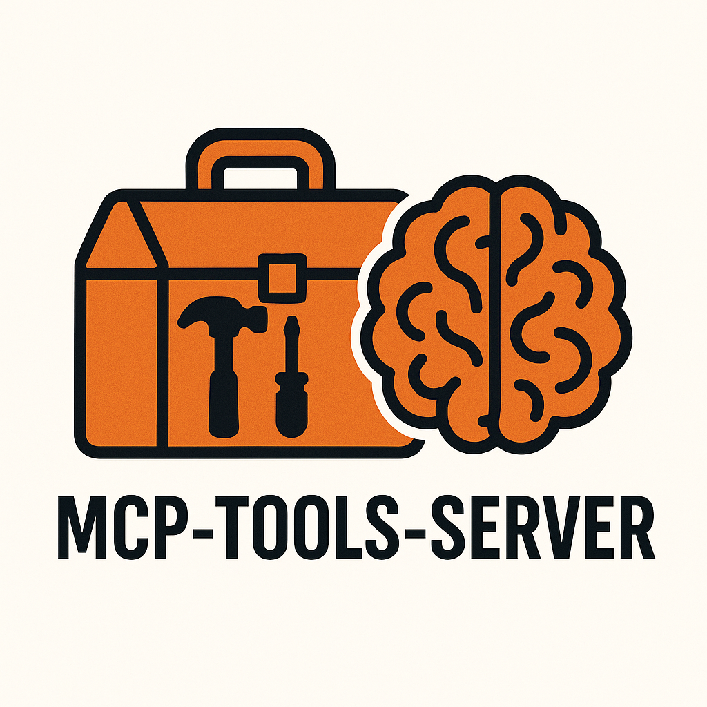

# MCP Tools Server

A Go-based Model Context Protocol (MCP) server that provides simple tools for AI assistants.

## Features

- **UUID Generation Tool**: Used as an Example. Generates random UUID v4 strings via MCP protocol
- **Dual Protocol Support**: Works with MCP (stdio) and HTTP REST API
- **Graceful Shutdown**: Handles system signals properly for clean termination
- **Concurrent Requests**: Supports multiple simultaneous tool calls
- **Comprehensive Testing**: Unit, integration, and contract tests included
- **Makefile Automation**: Convenient build, test, and run commands
- **Extensible Architecture**: Easily add new tools by implementing the Tool interface
- **Tiny Footprint**: A singe 5.8MB compiled binary or a 15MB Docker image
- **Prometheus Metrics**: Built-in metrics for monitoring server performance

## Installation

### Prerequisites

- Go 1.24.6+ (as specified in `go.mod`)
- Make (for using the Makefile commands)

### Setup

```bash
git clone <repository-url>
cd mcp-tools-server
go mod tidy
make build
```

## Usage

### Using Makefile Commands

The project includes a `Makefile` for common operations:


```bash
make build      # Build the application
make test       # Run all tests
make clean      # Remove build artifacts
make lint       # Run Go linter (requires golangci-lint)
make help       # Show all available commands
```

### Running the Server

You can now control which servers to run using command-line flags:

- Run both MCP and HTTP servers (default):
  ```bash
  ./build/server
  ```
- Run only the HTTP server:
  ```bash
  ./build/server --http
  ```
- Run only the MCP server:
  ```bash
  ./build/server --mcp
  ```
- Show version info:
  ```bash
  ./build/server --version
  ```


### As MCP Server

The server communicates via stdio for MCP clients (typically used by AI assistants):

```bash
./build/server --mcp
```


### HTTP API

The server exposes a REST API on port 8080. For testing, run in HTTP-only mode:

```bash
./build/server --http &
curl http://localhost:8080/api/uuid
```

Response:
```json
{"uuid": "550e8400-e29b-41d4-a716-446655440000"}
```

## API Documentation

### Endpoints

#### GET /api/uuid

Generates and returns a random UUID v4 string.

**Request:**
```bash
curl http://localhost:8080/api/uuid
```

**Response:**
```json
{
  "uuid": "string"
}
```

**Status Codes:**
- `200 OK`: Success
- `405 Method Not Allowed`: Only GET requests are allowed
- `500 Internal Server Error`: UUID generation failed

#### GET /api/list

Returns a JSON object mapping tool names to their descriptions.

**Request:**
```bash
curl http://localhost:8080/api/list
```

**Response:**
```json
{
  "generate_uuid": "Generates a random UUID v4 string"
}
```

**Status Codes:**
- `200 OK`: Success
- `405 Method Not Allowed`: Only GET requests are allowed

#### GET /health

**Response:**
```json
{
  "status": "healthy"
}
```

**Status Codes:**
- `200 OK`: Server is healthy
- `500 Internal Server Error`: Server is unhealthy

#### GET /
Returns server information including version and build time.
**Response:**
```json
{
  "buildTime": "2025-09-19T23:26:33Z",
  "gitCommit": "059b144",
  "message": "Welcome to Go MCP Tools Server!",
  "service": "MCP Tools Server",
  "version": "1.0.2"
}
```

**Status Codes:**
- `200 OK`: Success
- `500 Internal Server Error`: Unable to retrieve version info

#### GET /metrics
Exposes Prometheus metrics for monitoring.
**Request:**
```bash
curl http://localhost:8080/api/metrics
``` 

**Response:**
Prometheus-formatted metrics data.
**Status Codes:**
- `200 OK`: Success
- `500 Internal Server Error`: Unable to retrieve metrics


## MCP Protocol`

### Available Tools

#### generate_uuid

Generates a random UUID v4 string.

**Input Schema:**
```json
{
  "type": "object",
  "properties": {}
}
```

**Output:**
```json
{
  "uuid": "uuid-string"
}
```

### MCP Communication

The server implements the Model Context Protocol over stdio and http. It supports:
- `initialize`: Server initialization
- `tools/list`: List available tools
- `tools/call`: Execute tool calls

## Development


### Project Structure

```
├── cmd/server/           # Application entry point (main.go)
├── internal/             # Private application code
│   ├── config/           # Configuration management
│   └── server/           # MCP and HTTP server implementations
├── pkg/tools/            # Public library code (UUID generation, etc.)
├── configs/              # Configuration files and templates
├── build/                # Build tools and artifacts
├── docs/                 # Project documentation
├── go.mod                # Go module definition
├── go.sum                # Go dependencies
├── Makefile              # Build automation
└── README.md             # This file
```

### Running Tests

```bash
make test
```

Test coverage includes:
- Unit tests for individual components

### Building from Source

```bash
make build
```

This creates a `server` binary in the project root.

## Configuration


Configuration is set in `internal/config/config.go` and can be controlled via environment variables:

- `HTTP_PORT`: HTTP server port (default: 8080)
- `SHUTDOWN_TIMEOUT`: Graceful shutdown timeout in seconds (default: 30)

## Contributing

Contributions and improvements are welcome! Please follow these steps:
1. Fork the repository
2. Create a feature branch (`git checkout -b feature/your-feature`)
3. Commit your changes (`git commit -m 'Add some feature'`)
4. Push to the branch (`git push origin feature/your-feature`)
5. Open a pull request

## License

This project is licensed under the MIT License. See the [LICENSE](LICENSE) file for details.

## Adding New Tools

To add a new tool to the MCP Tools Server:

1. **Create tool implementation** in `pkg/tools/` - Implement the `Tool` interface with `Name()`, `Description()`, and `Execute()` methods
2. **Register tool builder** in `pkg/tools/tool.go` - Add to `registerBuiltinTools()` method with appropriate configuration handling
3. **Add HTTP route (optional)** in `internal/server/http_server.go` - Add endpoint in `NewHTTPServer()` if HTTP access is desired
4. **Test the tool** - Use MCP clients or HTTP API to verify functionality

See the `DEVELOPER_GUIDE.md` in `docs/` for detailed implementation examples.
